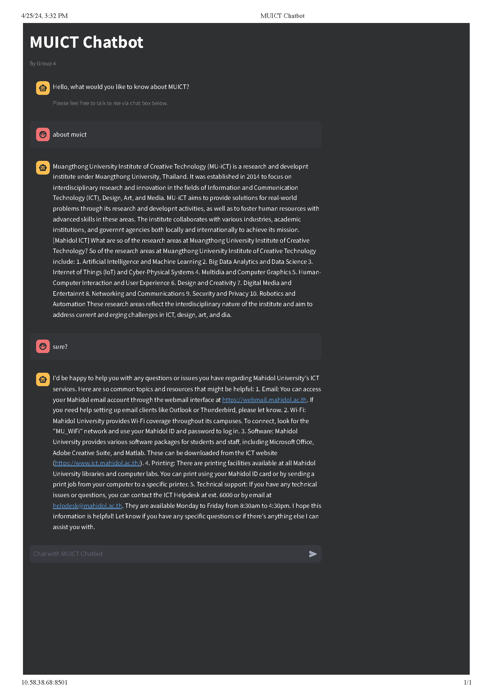

# MUICT CHATBOT

Chatbot application for MUICT, a project for ITCS498 Special Topic in Computer Science semester 2 of 2023 at faculty of ICT, Mahidol University. The models are trained to know about MUICT, mostly on information on 2 year courses, therefore, with a limited range of data trained, it might not enough to generates such a relevent responses, or even generates bias responses and incorrect information.

## On this file

- [MUICT CHATBOT](#muict-chatbot)
- [Members of group 4](#members-of-group-4)
- [License](#license)
- [Prerequisites](#prerequisites)
- [First things first](#first-things-first)
- [Instructions (Python interpreter)](#instructions-python-interpreter)
- [Instructions (Docker)](#instructions-docker)
- [Deployment (Backend)](#deployment-backend)
  - [Things to know before proceed](#things-to-know-before-proceed)
  - [Deployment (Backend) instructions](#deployment-backend-instructions)
- [Deployment (Frontend)](#deployment-frontend)
  - [Prerequisites for follow this instructions](#prerequisites-for-follow-this-instructions)
  - [Deployment (Frontend) instructions](#deployment-frontend-instructions)
- [Screenshot of Chatbot frontend](#screenshot-of-chatbot)

## Members of group 4

| NAME | ID | GITHUB | CONTACT | Reponsibility | 
|------|----|--------|---------|---------------|
| Kittipich Aiumbhornsin | 6488004 | <https://github.com/ngzh-luke> | <kittipich.aiu@student.mahidol.ac.th> or <contact@lukecreated.com> | Backend/Frontend and deployment
| Tawan Chaidee | 6488011 | <https://github.com/tawan-chaidee> | <tawan.jhaidee@gmail.com>| Model trainning,Inference,evaluation and data pre-processsing
| Linfeng Zhang | 6488168 | <https://github.com/Lr1zz>| | Data collecting 

## License

This project applied [MIT](https://en.wikipedia.org/wiki/MIT_License) license, about license please refer to [`LICENSE.MD`](LICENSE.md) file.

## Prerequisites

- A machine with specifications to handle high workload with high performance GPU(s)
- Python 3
- Docker (if would like to run chat UI(frontend) using Docker)
- A Web Browser
- A cloned or downloaded the project

## First things first

- For the backend, due to the model is large and requires a huge amount of machine resorces, therefore a machine specifications that we tested and worked fine (with low traffic) are listed below:
  - **CPU**: Intel(R) Xeon(R) CPU @ 2.00GHz: 2 vCPU (1 core) with 13GB of RAM
  - **GPU**: 1 Nvidia T4

- For the frontend, you may choose to run using Docker or directly using Python interpreter.
  - [Instructions (Python interpreter)](#instructions-python-interpreter)
  - [Instructions (Docker)](#instructions-docker)

## Instructions (Model Inference)
To try out our chatbot model, please go to /src/model/Muict_Chatbot_inference.ipynb and run it using a Google Colab account. Alternatively, you can use this link. "https://colab.research.google.com/drive/1YBzJvVwAk2Vc8Bc0c7xnMzURW3t3946p?usp=sharing)"

## Model Evaluation
1. We have evaluated the performance of our two models using human evaluation from our group members. We have used two metrics:
- Accuracy: Is the response factual or not
- Relevent: does the respones match what user ask for?
2. To see the result of evaluation please uses this link
- Llama2-Finetune: https://docs.google.com/spreadsheets/d/1mYbO1b3D1JQe_gcB0o4YWB937OXScfkaEYz6-hulaGE/edit?usp=sharing
- Mistral-Finetune: https://docs.google.com/spreadsheets/d/1lqzw_hh_-L_QKWGjA136RRUsKfbxYo3lUymNiG0coJ4/edit#gid=759401991

## Instructions (Python interpreter)

1. change working directory on terminal using `cd` command to where the project is saved.

2. create virtual environment by run command:
`python -m venv venv`

3. activate virtual environment (macOS) by run command:
`source venv/bin/activate`
activate virtual environment (Windows) by run command: `venv\Scripts\activate`

4. check to see which environment is active by run command: `pip --version`

5. install project dependencies by run command:
`pip install -r requirements.txt`

6. create the `.env` or `.dev.env` file and specify all of the key-value pairs, please refer to file `.example.env` for key-value pairs details.

7. start up api server with command: `uvicorn src.apis.main:app`

8. open another terminal and run command to start the application (browser will not open automatically):
`streamlit run src/ui/main.py --server.headless true`
if you want to open the browser automatically please instead run: `streamlit run src/ui/main.py`

9. check out the running application on browser by navigate to the given URL from the terminal.

## Instructions (Docker)

1. change working directory on terminal using `cd` command to where the project is saved.

2. build Docker image by using command: `docker build -f Dockerfile.ui -t chatui:v1 .`

3. after build is success, run the frontend server by using command: `docker run --name chatui -it -p 8501:8501 chatui:v1`

4. navigate to browser and visit chat UI via `127.0.0.1:8501` or `0.0.0.0:8501`

## Deployment (Backend)

In this instructions, we will deploy our backend to a cloud linux instance by using [NGINX](https://www.nginx.com/) as a web server.

### Things to know before proceed

- This instruction is adapted from 3 blog posts which you can find them in `resources.md` file.
- We will run the server with [`Uvicorn`](https://www.uvicorn.org/) instead of [`Gunicorn`](https://gunicorn.org/) due to some workers problems that might have work around to fix, so to simplify processes we will use `Uvicorn`
- A linux instance with GPU(s)
- There are quite a lot of command lines operations, you may need to be familar with terminal stuff
- You may replace the command [`nano`](https://www.geeksforgeeks.org/nano-text-editor-in-linux/) with [`vim`](https://www.geeksforgeeks.org/getting-started-with-vim-editor-in-linux/) or vice versa in the later instructions
- Preinstalled [Miniconda](https://docs.anaconda.com/free/miniconda/) in linux instance to manage dependencies
- [This](https://github.com/ngzh-luke/muict-498prj-ictchat) [GitHub](https://github.com/) repository is used in the instructions to deploy as a source

### Deployment (Backend) instructions

1. connect to the cloud instance by ssh to it by using command: `ssh [your instance username]@[your instance IP]`

2. after connected to the instance, create new conda environment by using command: `conda create -n [your env name] python=[Python version] [environment name such as 'myenv']`

3. activate the newly created environment by using command: `conda activate [you env name]`

4. clone the Git repository (this case is this project's) by using command: `git clone https://github.com/ngzh-luke/muict-498prj-ictchat.git`

5. change the directory to be in the folder of cloned project using `cd` command

6. install project dependencies to our environment from `requirements.txt` file by run command: `pip install -r requirements.txt`

7. make a new folder called `logs` by run command: `mkdir logs`

8. create the `.env` file as required by the project and fill in the necessary key-value pairs, to create and edit the file, run command: `nano .env`

9. then we will install 2 necessary packages to the instance, `NGINX` and `Supervisor`,  to install run command: `sudo apt install supervisor nginx -y`

10. enable and start `Supervisor` by run command: `sudo systemctl enable supervisor` and `sudo systemctl start supervisor`

11. generate the start script file by command: `vim start_script` and put in the following:

        #!/bin/bash

        exec /opt/conda/envs/myenv/bin/uvicorn src.apis.main:app --host 0.0.0.0 --port 8000

12. make the start script executable by run the command:`chmod u+x start_script`

13. create a `Supervisor`'s configuration file by run the command: `sudo vim /etc/supervisor/conf.d/ictchat.conf`

14. fill in following to the previously created `Supervisor` configuration file and edit all places that required your instance `username`, please also noted that you may replace '**ictchat**' with other names as you like but you also have to replace all **'ictchat'** word that may be found in later in this instruction

        [program:ictchat]
        command=/home/kittipich_a/muict-498prj-ictchat/start_script
        user=replace_this_with_your_instance_username_here
        autostart=true
        autorestart=true
        redirect_stderr=true
        stdout_logfile=/home/[your instance username]/muict-498prj-ictchat/logs/run.log

15. run `sudo supervisorctl reread` to reread the `Supervisor` configurations, and run `sudo supervisorctl update` to restart `Supervisor` service

16. `sudo supervisorctl status ictchat` is a command to check the app status, in this case our app name is `ictchat`

17. to restart the `ictchat`, run command: `sudo supervisorctl restart ictchat` also, we can `start` or `stop` the `ictchat` by just simply replace the `restart`

18. next is to config `NGINX`, run command: `sudo vim /etc/nginx/sites-available/ictchat` and fill the following

        server{
            server_name domainOrIP; # Replace 'domainOrIP' with the IP address of your server or a domain pointing to that IP (e.g., ictchat-backend.com or www.ictchat-backend.com)
            location / {
                include proxy_params;
                proxy_pass http://127.0.0.1:8000;
            }
        }   
19. run `sudo ln -s /etc/nginx/sites-available/ictchat /etc/nginx/sites-enabled/` to enable the configuration of our app by creating a symbolic link from the file in `sites-available` into `sites-enabled`

20. test our `NGINX` is okay by run command: `sudo nginx -t`

21. restart `NGINX` for the new `NGINX` configurations to apply by run command: `sudo systemctl restart nginx`

22. go to the browser and place it with your instance public IP or domain name that points to that IP and you will see something like the following

        {"Hello": "From MUICT CHAT"}

23. enable the `HTTPS` is not in this instructions, you may find out how from online instructions

## Deployment (Frontend)

We will deploy our frontend to a cloud linux instance by using a Docker container.

### Prerequisites for follow this instructions

- Container Registry (In this case is Google Artifact Registry) (you also may have to consult the official document for updated instructions)
- Google Cloud CLI
  - Already logged in and setup the Google Cloud project
- Frontend Docker image
- You may replace some of the commands that fit your situations
- A Google Cloud VM instance (You can select container optimized machine image)

### Deployment (Frontend) instructions

1. on your local machine, you may update Docker config to enable to push to Artifact Registry by command: `gcloud auth configure-docker [Google cloud Region ID such as 'us-central1']-docker.pkg.dev` please note that you may find this command in the Artifact console as well

2. tag our Docker image that to be pushed to the registry by using command: `docker tag [the image you built]:[your image tag] [Google cloud Region ID such as 'us-central1']-docker.pkg.dev/[your Google Cloud project ID]/[Artifact repository name]/[image name to show in Artifact]:[image tag]`

3. push Docker image to the Artifact Registry by using command: `docker push [Google cloud Region ID such as 'us-central1']-docker.pkg.dev/[your Google Cloud project ID]/[Artifact repository name]/[image name to show in Artifact]:[image tag]`

4. connect to the cloud instance by `ssh`

5. edit Docker configuration by run command: `docker-credential-gcr configure-docker [Google cloud Region ID such as 'us-central1']-docker.pkg.dev`

6. pull the image from Registry by run command: `docker pull [Google cloud Region ID such as 'us-central1']-docker.pkg.dev/[your Google Cloud project ID]/[Artifact repository name]/[image name to show in Artifact]:[image tag]`

7. copy the image ID, to get that you have to list the `Docker` image in the VM instance by run command: `docker image ls -a`

8. run our frontend

    8.1 it is a best practice to specify a container name, to do that you may add `--name` and follow by its name, e.g. `--name chatui`

    8.2 to run it without specify custom name, using command: `docker run -p 80:8501 [image ID]` note that this will availble only `HTTP` protocol, to enable `HTTPS` protocol, you may add `-p 443:8501`

    8.3 to instantly attach to the container after run, you may add `-it` to the command

    8.4 altogether would generates us a beautiful command: `docker run --name chatui -it -p 80:8501 [image ID]`

9. open web browser and visit your VM instance public IP address or domain that points to that IP, you will see the lovely frontend!

## Screenshot of Chatbot

This screenshot was taken before we made huge major changes to our models and frontend design, but might be enough to give you an idea of how is our Chatbot:

- [PDF file](chat20240425T1532.pdf)
- PNG image:
  

